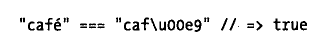

# 01词法结构

## 区分大小写

JavaScript是区分大小写的，而HTML是并不区分大小写（尽管XHTML区分大小写（我了解到XHTML已被淘汰））。

## Unicode转义序列

JavaScript用Unicode字符集编写，在有些计算机硬件和软件里，无法显示或输入Unicode字符全集，为了支持那些设备，JavaScript定义了一种特殊序列，使用6个ASCII字符来代表任意16位Unicode内码。例：

