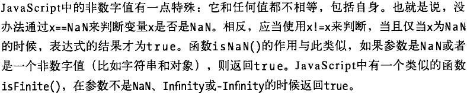
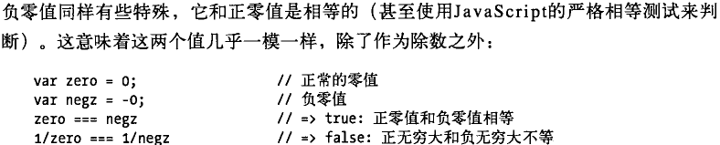
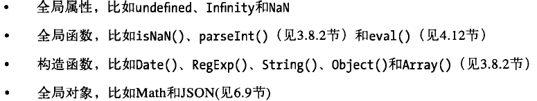
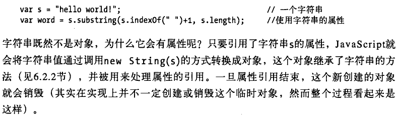
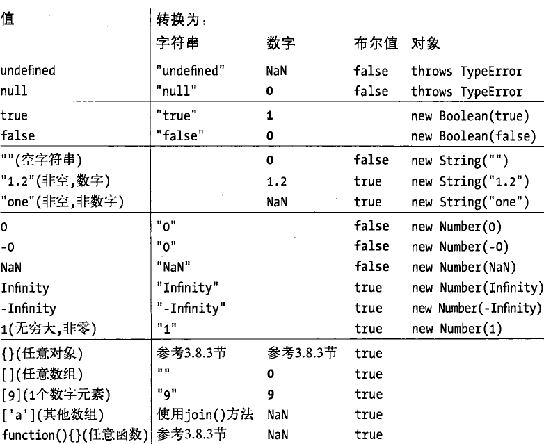

[TOC]

# 02类型、值和变量

JavaScript的数据类型分为两类：原始类型（primitive type）和对象类型（object type）。

原始类型包括：数字、字符串、布尔值、null、undefined。

对象类型：**数组(Array)**、**函数(Function)**、自定义对象、日期（Date）、正则（RegExp）、错误（Error）。

## 数字

JavaScript不区分整数值和浮点数值，全用IEEE-754标准定义的64位浮点数表示。

JavaScript预定义了全局变量Infinity(-Infinity)和NaN(not a number)，用来表示正无穷大和非数字值，这两个值是只读的。

## 文本

在JavaScript中字符串是固定不变的，类似replace()和toUpperCase()的方法都返回新的字符串。

## 布尔值

任意JavaScript的值都可以转换为布尔值。下面这些值会转换成false：

undefined；null；0；-0；NaN；""//空字符串；

## null和undefined

都不包含任何属性和方法

## 全局对象(global object)

当JavaScript解释器启动时（或者任何web浏览器加载新页面时），它将创建一个新的全局对象，并给它一组定义的初始属性：

当声明一个JavaScript全局变量时，实际上是定义了全局对象的一个属性。

## 包装对象

但是不能给图中s添加新属性，因为它是字符串，不是对象类型。

## 不可变的原始值和可变的对象引用

对原始类型的比较是值的比较，对对象的比较是引用的比较

## 类型转换

对象转换为字符串调用toString()

对象转换为数字调用valueOf()，但大多数对象没有转换为数值的需求，因此默认的valueOf()方法简单地返回对象本身，而不是返回原始值。

对于将对象转为字符串，如果对象没有toString()方法，或者这个方法不返回一个原始值，那么JavaScript会调用valueOf()方法，将返回的原始值转换为字符串，要是valueOf()也不存在或不返回一个原始值，则抛异常。

对于将对象转换为数字，同上。

这就是为什么空数组会转换成数字0。<!--数组继承了默认的valueOf()方法，该方法返回一个对象而不是一个原始值，因此会调用toString()方法，转换为空字符串，而空字符串转换为数字是0-->

"+"、"=="、"<"等运算符会做对象到原始值的转换，先尝试调用valueOf()，然后调用toString()。除了日期对象。

## 变量作用域

JavaScript函数里声明的所有变量（但不涉及赋值）都在预编译时被提前至函数体的顶部。

作用域链，例：

bn的作用域链为bn->fn->全局,

fn的作用域链为fn->全局

如果整条作用域链都找不到所需变量，则抛异常。