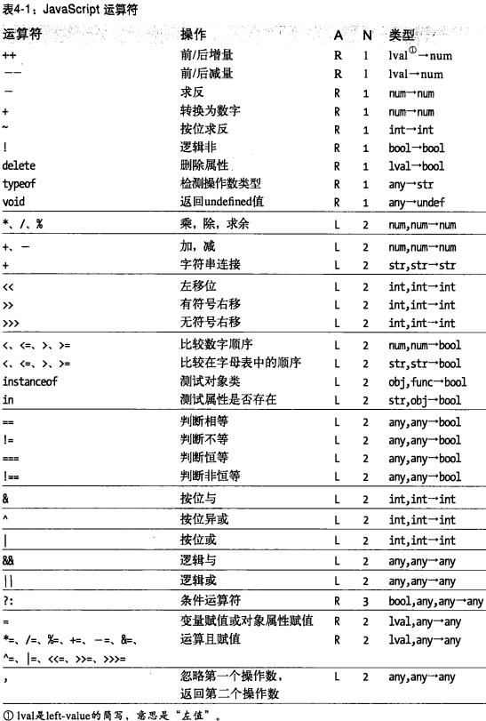
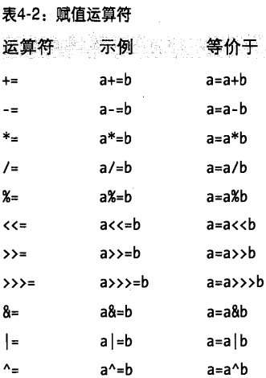

# 03表达式和运算符

## 原始表达式

最简单的表达式是“原始表达式”，它是表达式的最小单位（不再包含其他表达式）。

JavaScript中的原始表达式包含常量（直接量）、关键字和变量。

## 对象创建表达式

如果一个对象创建时不需要传入任何参数给构造函数的话，那么可以省略圆括号：

new Object；new Date；

## 运算符

大多数运算符都是由标点符号表示的，比如"+"和"+"。另外一些运算符是由关键字表示的，比如delete和instanceof。

tips：&&运算符的短路行为见05对象的原型链（属性值访问错误）例子。

## 关系表达式

"=="称作相等运算符，用来检测两个操作数是否相等，允许类型转换。

"==="称作严格相等运算符（恒等运算符），不允许类型转换。

tips：1.JavaScript对象的比较是引用的比较

​           2.var x = NaN;console.log(x !== x);//true,NaN和任何值都不相等，包括它本身

​           3.对象的比较会先转换为原始值，先调用valueOf()，否则调用toString()。