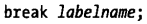

[TOC]

# 语句

;为空语句。

## for语句

### 迭代多变量

### 迭代链表数据结构

## for/in语句

for/in并不会遍历对象的所有属性，只有可枚举的属性才会遍历到，代码中定义的所有属性和方法都是可枚举的（但可通过特殊手段让可枚举属性变为不可枚举，详见05对象）。如果for/in循环体删除了还未枚举的属性，那么这个属性将不会再枚举到。

tips：这里拿到的variable是object的属性，可通过object[variable]访问属性值。

### 属性枚举的顺序

主流是按属性定义的先后顺序枚举，在一下情况可能会有不同：

## 跳转语句

### 标签语句

类似汇编，其中mainloop必须为合法命名标识符，不能为保留字。

### break

跳出最内层循环或switch语句。

break后可跟标签，表示跳转到这个标签所标识的**语句块的结束**（即这块代码的结尾，不执行标签这块代码）。

### continue

立即执行下一次循环，只能在循环体内使用。

后面可跟标签语句，跳转到这个标签所标识的语句块的开始，例子见标签语句。

### 异常throw/try/catch/finally

例：throw new Error("异常")；

try，catch类似C++。finally里的语句不论try里是否抛了异常都会执行（就算你在try里return了也会抢先执行），因此适合try之后的清理工作。

## with语句

用于临时扩展作用域链，语法：

性能差，不推荐使用。

## debugger语句

debugger语句通常什么也不做，当调试程序可用并运行的时候，JavaScript解释器将会以调试模式运行，在语句处产生一个断点。

## "use strict"

这是一条指令，指令不是语句（但非常接近于语句）。

表示作用域内的代码要采用严格模式。严格模式可以理解为JavaScript语言缺陷太多，严格模式作了限制、规范。