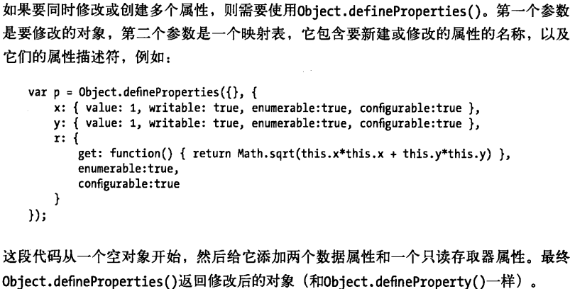

[TOC]

# 05对象

## 原型

### 理解

每个JavaScript对象（null除外）都关联一个原型对象，从原型继承属性。

通过Object.prototype获得对原型对象的引用。

```js
var obj = new Object();
```

以上代码的 `new` 运算符更多的充当着语法糖角色，大致上来说，`new` 运算符主要有以下功能：

- 新建并返回一个构造器函数的实例对象，`Constructor {}` ，然后将构造函数中的 `this` 对象复制到新建的实例对象 `this` 上。
- 把构造函数的 `prototype` 对象复制到新建对象的 `__proto__` 属性上，以便继承该构造器 `prototype` 对象上的属性与方法，例如：

```js
    var obj = new Object();
    obj.__proto__ === Object.prototype; // true;
```

原型图解：


### Object.create()

此静态函数创建一个新对象，其中第一个参数是这个对象的原型

```js
var obj = {a: 1};
var o = Object.create(obj);
console.log(o.__proto__ === obj);// true;
```

## 原型链

### 理解

利用原型让一个引用类型继承另一个引用类型的属性和方法。图解：


### 属性访问错误

访问对象的属性时，如果在它的原型链上不存在会返回undefined。例

```js
book.subtitle;//undefined,属性不存在
```

但如果继续访问这个不存在的对象的属性就会报错。例

```js
var len = book.subtitle.length;//抛类型错误异常
```

为了避免出现这种情况，我们有一种简练的常用方法，获取subtitle的length或undefined，而不报错。

```js
var len = book && book.subtitle && book.subtitle.length;
/*要理解这行代码，需要知道&&运算符的“短路”行为，即
  如果左操作数是真值，那么整个表达式的结果依赖于右操作数的值。因此，当左操作数是真值时，&&运算符将计算右操作数的值并将其返回作为整个表达式的计算结果；当左操作数为假，返回左操作数的值*/

len = len || [];//类似的，如果第一个实参是真值的话就返回第一个实参，否则返回第二个实参，前提是len必须已定义
```

## delete删除属性

delete只是断开属性与宿主对象的联系，而不会去操作属性中的属性。例

```js
var a = {p:x:1};
var b = a;
delete a.p;//执行这段代码后b.x的值依然是1。由此不严谨删除可能会造成内存泄漏，所以在销毁对象的时候要遍历属性中的属性，依次删除。
```

## 检测属性

可以通过in运算符、hasOwnProperty()、propertyIsEnumerable()方法来完成这个工作。

```js
var o = { x:1 }
"x" in o;//true
o.hasOwnProperty("x");//true
o.propertyIsEnumerable("x");//true,propertyIsEnumerable()只有检测到是自有属性且这个属性的可枚举性为true时它才返回true
```

## 属性的特性

对象属性是由名字、值和一组特性构成的。属性值可以被一个或两个方法替代——getter和setter，由getter和setter定义的属性称作”存储器属性“，它不同于“数据属性”，数据属性只有一个简单的值。

数据属性的4个特性：值（value）、可写性（writable）、可枚举性（enumerable）、可配置性（configurable）。

存取器属性的四个特性：读（get）、写入（set）、可枚举性、可配置性。

### 获取属性描述符

通过Object.getOwnPropertyDescriptor()可以获得某个对象特定属性的属性描述符：

```js
//返回{value: 1, writable: true, enumerable: true, configurable: true}
Object.getOwnPropertyDescriptor({x:1}, "x");

var random = {
    get octet(){return Math.floor(Math.random()*26);}
}
//返回{get: /*func*/, set: undefined, enumerable: true, configurable: true}
Object.getOwnPropertyDescriptor(random, "octet");
```

### 设置属性描述符

通过Object.defineProperty()可以修改某个对象特定属性的属性描述符：

```
var o = {};
Object.defineProperty(o, "x", {
	value: 1,
	writable: true,
	enumerable: fasle,
	configurable: true,
})
```



## 对象的三个属性

### 原型

\__proto__

### 类

对象的类属性是一个字符串，用以表示对象的类型信息。

间接通过toString()方法查询它。

### 可扩展性

一个对象转换为不可扩展的，就无法再将其转换回可扩展的了。

通过Object.preventExtensions()将对象转换为不可扩展的，将待转换的对象作为参数传进去。这种方法转换后给一个不可扩展的对象的原型添加属性，这个不可扩展的对象同样会继承这些新属性。

Object.seal()除了能够将对象设置为不可扩展的，还可以将对象的所有自有属性都设置为不可配置的。可以使用Object.isSealed()检测对象是否封闭。

Object.freeze()将更严格地锁定对象——冻结。除了将对象设置为不可扩展的和将其属性设置为不可配置的之外，还将它自有的所有数据属性（存取器属性不受影响）设置为只读。使用Object.isFrozen()检测对象是否冻结。

三个方法返回传入的对象。

## 序列化对象

指将对象状态转换为字符串，也可将字符串还原为对象。

ES5提供了内置函数JSON.stringify()和JSON.parse()用来序列化和还原JavaScript对象。

```js
var o = {x:1, y:{z:[false,null,""]}};
s = JSON.stringify(o);//字符串：{"x":1,"y":{"z":[false,null,""]}}
p = JSON.parse(s);//还原为Object
```

只能序列化可枚举属性。
