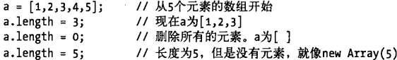
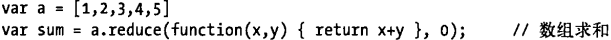
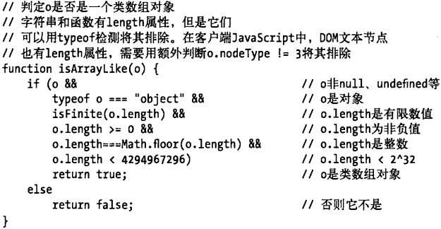

# 06数组

## 数组长度

## 数组方法

详情看MDN链接:https://developer.mozilla.org/zh-CN/docs/Web/JavaScript/Reference/Global_Objects/Array#%E5%AE%9E%E4%BE%8B%E5%B1%9E%E6%80%A7

### 常用

Array.push()，向数组的末尾添加一个或多个元素，并返回新的数组长度，原数组改变

Array.pop()，删除并返回数组的最后一个元素，若该数组为空，则返回undefined，原数组改变

Array.join()，将数组中的所有元素转换成字符串拼接在一起，参数默认为','

Array.unshift()，向数组的开头添加一个或多个元素，并返回新的数组长度，原数组改变

Array.shift()，删除数组的第一项，并返回第一个元素的值。若该数组为空，则返回undefined，原数组改变

Array.concat(arr1,arr2…)，合并两个或多个数组，生成一个新的数组，原数组不变

Array.reverse()，将数组倒序，原数组改变

Array.sort()，对数组元素进行排序，按照字符串UniCode码排序，原数组改变

Array.slice()，按照条件查找出其中的部分内容，不改变原数组

Array.splice(index,howmany,arr1,arr2…) ，用于添加或删除数组中的元素。从index位置开始删除howmany个元素，并将arr1、arr2…数据从index位置依次插入。howmany为0时，则不删除元素

### ES5新增

Array.forEach(function)，用于调用数组的每个元素，并将元素传递给回调函数。原数组不变。（注意该方法和map的区别，若直接打印Array.forEach，结果为undefined）

Array.map(function)，原数组的每一项执行函数后，返回一个新的数组，原数组不变

Array.filter(function)，过滤数组中，符合条件的元素并返回一个新的数组

Array.every(function)，对数组中的每一项进行判断，若都符合则返回true，否则返回false。类似离散数学中的全称量词“∀”

Array.some(function)，对数组中的每一项进行判断，至少有一个满足则返回true，即都不满足返回false。类似离散数学中的存在量词“∃”

Array.reduce()，第一个参数是函数（函数中的第一个参数为之前的返回值）；第二个参数可选，是首次传递给函数第一个参数的初始值，省略了代表首次将数组的第一个元素和第二个元素作为参数初始值。例：

Array.reduceRight()，即从右侧开始（上面方法是从左侧开始的）

Array.indexOf()，检测当前值在数组中第一次出现的位置索引

Array.lastIndexOf()，检测当前值在数组中最后一次出现的位置索引

## 数组类型

Array.isArray()检测参数是否为数组

## 类数组对象

偶尔出现，例如Arguments对象，document.getElementsByTagName()也返回类数组对象。下面有一个函数可以用来检测类数组对象：

