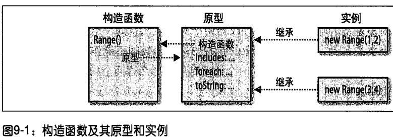
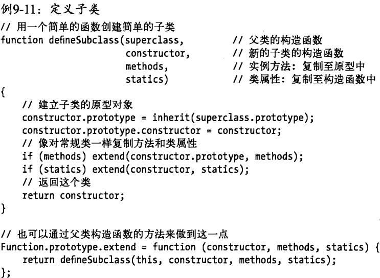

# 08类和模块

## 使用构造函数定义类

```js
//这是一个构造函数，用以初始化新创建的”范围对象”
//注意，这里并没有创建并返回一个对象，仅仅是初始化
function Range(from, to) {
    //存储"范围对象”的起始位置和结束位置(状态)
    //这两个属性是不可继承的，每个对象都拥有唯一的属性
    this.from = from;
    this.to = to;
}
//所有的”范围对象”都继承自这个对象
//注意，属性的名字必须是"prototype
Range.prototype = {
    //如果x在范围内，则返回true;否则返回false
    //这个方法可以比较数字范围，也可以比较字符串和日期范围
    includes: function (x) {
        return this.from <= x && x <= this.to;
    },
    //对于范围内的每个整数都调用一次f
    // 这个方法只可用于数字范围
    foreach: function (f) {
        for (var x = Math.ceil(this.from); x <= this.to; x++) f(x);
    },
    // 返回表示这个范围的字符串
    toString: function () {
        return "(" + this.from + "..." + this.to + ")";
    }
};
//这使用”范围对象"的一些例子
var r = new Range(1, 3); //创建一个范围对象
r.includes(2); //=> true:2在这个范围内
r.foreach(console.log); //输出123
console.log(r); // 输出(1...3)
```



可以发现，上例代码中重写预定义的Range.prototype对象不含constructor属性，我们可以通过补救措施来修正这个问题，显示给原型添加一个构造函数：

```js
Range.prototype = {
	constructor:Range,// 显式设置构造函数反向引用
	includes: function(x) { return this.from <= x && x <= this.to; },
	foreach: function(f){
		for(var x=Math.ceil(this,from); x <=this.to; x++) f(x);
	},
	toString:function() { return "(" + this.from + "..." + this.to + ")" ; }
};
```

还有一种常见办法是使用预定义的原型对象，给其添加方法：

```js
Range.prototype.includes = function(x) { return this.from <= x && x <= this.to; };
Range.prototype.foreach = function(f){
    for(var x = Math.ceil(this,from); x <= this.to; x++) f(x);
};
Range.prototype.toString = function() { return "(" + this.from + "..." + this.to + ")" ; };
```

## 类的扩充

JavaScript中基于原型的继承机制是动态的：如果创建对象之后原型的属性发生改变，也会影响到继承这个原型的所有实例对象。这意味着我们可以给原型对象添加新方法来扩充JavaScript类。

## 类和类型

### isPrototypeOf 和 instanceof 的区别

A.isPrototypeOf(B) 判断的是A对象是否存在于B对象的原型链之中
A instanceof B  判断的是B.prototype是否存在与A的原型链之中

所以就有下面的结论：
如果 A.isPrototypeOf(B)  返回true 则B instanceof A 一定返回true

### constructor属性

另一种识别对象是否属于某个类的方法是使用constructor属性。因为构造函数是类的公共标识，所以最直接的方法就是使用constructor属性，例：

```js
function typeAndValue(x) {
    if (x == null) return ""; // null和undefined没有构造函数
    switch (x.constructor) {
        case Number:
            return "Number: " + x; //处理原始类型
        case String:
            return "Number: " + x;
        case Date:
            return "Number: " + x; //处理内置类型
        case RegExp:
            return "Number: " + x;
        case Complex:
            return "Number: " + x; //处理自定义类型
    }
}
```

## 私有变量实现

通过将变量闭包在一个构造函数内来模拟实现私有实例字段，调用构造函数会创建一个实例。例：

```js
function Range(from, to) {
    //不要将端点保存为对象的属性，相反
    //定义存取器来返回端点的值
    //这些值保存在闭包中
    this.from = function(){ return from; };
    this.to = function(){ return to; };
}
//原型上的方法无法直接操作端点
//必须操作存取器方法
Range.prototype = {
    constructor: Range,
    includes: function (x) {
        return this.from() <= x && x <= this.to();
    },
    foreach: function (f) {
        for (var x = Math.ceil(this.from()); x <= this.to(); x++) f(x);
    },
    toString: function () {
        return "(" + this.from() + "..." + this.to() + ")";
    }
};
```

看起来像模像样，但是仍可以修改，例：

```js
var r = new Range(1,5);
r.from = function(){return 2;};
```

## 定义子类

```js
B.prototype = inherit(A.prototype);//子类派生自父类
B.prototype.constructor = B;//重载继承来的constructor属性
```



## 模块

拿自定义的myObjects类来说，它定义了一个全局构造函数myObjects()，然后给这个类定义了很多实例方法，但将这些实例方法存储为myObjects.prototype的属性，因此这些方法不是全局的：

`var myObjects = {}； `

这个myObjects对象是模块的命名空间，并且将每个类都定义为这个对象的属性：

`myObjects.Hand = myObjects.AbstractEnumerableObject.extend(...);`

如果想使用这样定义的类，需要通过命名空间来调用所需的构造函数：

`var o = new myObjects.Hand(2);`