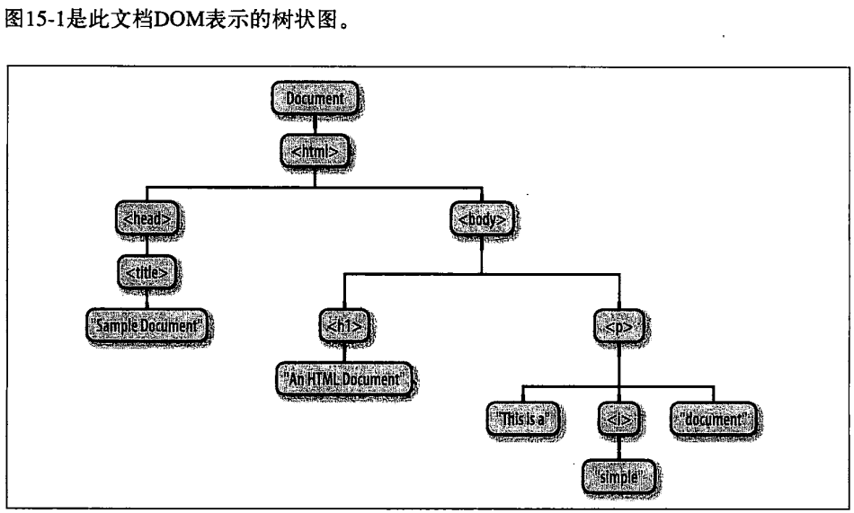
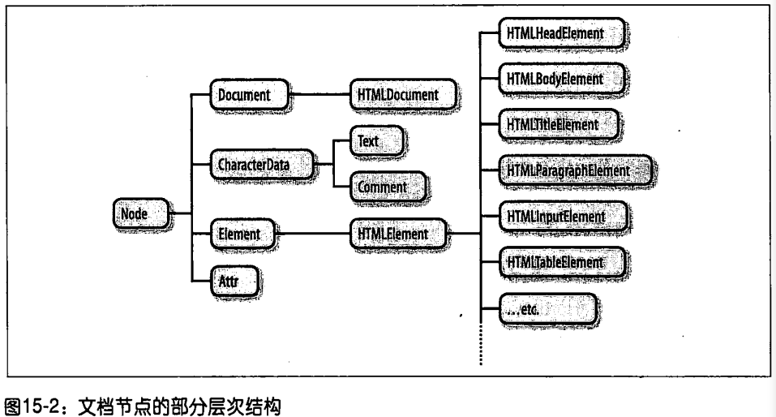
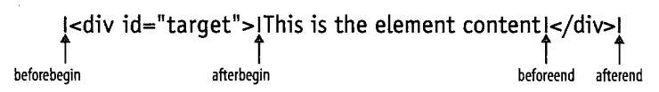

# 14脚本化文档

## DOM概览

DOM（document Object Model）文档对象模型，是表示和操作HTML和XML文档内容的基础API。

```html
<html>
<head>
    <title>Sample Document</title>
</head>
<body>
    <h1>An HTML Document</h1>
    <p>This is a <i>simple</i> document.</p>
</body>
</html>
```





Document、Element和Text是Node的子类。

document对象是HTMLDocument的一个实例，表达整个HTML页面。

## 文档结构和遍历

文档结构可以看作一棵节点对象树。

Node定义了以下重要的属性：

1. parentNode
2. childNodes
3. firstChild、lastChild
4. nextSibling、previousSibling：该节点的兄弟节点中的前一个和下一个。
5. nodeType：该节点的类型。9代表Document节点，1代表Element节点，3代表Text节点，8代表Comment节点，11代表DocumentFragment节点。
6. nodeValue
7. nodeName

## 元素的内容

`<p>This is a <i>simple</i> document.</p>`问，\<p>元素的"内容"是什么？回答这个问题有三个方法，各有千秋：

1. 内容是HTML字符串“This is a \<i>simple\</i> document
2. 内容是纯文本字符串“This is a simple document”
3. 内容是一个Text节点、一个包含了一个Text子节点的Element节点和另外一个Text节点。

### 作为HTML的元素内容

IE引入的一个特性是insertAdjacentHTML()方法，它将在HTML5中标准化，它将任意的HTML标记字符串插入到指定的元素“相邻”的位置。标记是该方法的第二个参数，并且“相邻”的精确含义依赖于第一个参数的值。第一个参数为具有以下值之一的字符串：“beforebegin“、afterbegin”、“beforeend”和“afterend”。这些值对应的插入点图所示：



## 创建、插入和删除节点

### 创建节点

createTextNode()：创建Text节点，参数为字符串

createElement()：创建Element节点，参数为元素名字符串

### 插入节点

appendChild()：在需要插入的Element节点上调用的，它插入指定的节点使其成为那个节点的最后一个子节点。

insertBefore()：接受两个参数。第一个参数就是待插入的节点，第二个参数是已存在的节点，新节点将插入该节点的前面。该方法应该是在新节点的父节点上调用，方法的第二个参数必须是该父节点的子节点。如果传递nu11作为第二个参数，insertBefore()的行为类似appendChild()，它将节点插入在最后。` parent.insertBefore(child, parent.childNodes[n]);`

### 删除和替换节点

removeChild()：在父节点上调用，将需要删除的子节点作为参数传递给它。当然，可以这样写：`n.parentNode.removeChild(n);`

replaceChild()：在父节点上调用，第一个参数是新节点，第二个参数是需要替代的节点。例：`n.parentNode.replaceChild(document.createTextNode("newNode"), n);`

### 使用DocumentFragment

DocumentFragment是一种特殊的Node，它作为其他节点的一个临时的容器。像这样创建一个DocumentFragment:
`var frag = document.createDocumentFragment();`
像Document节点一样，DocumentFragment是独立的，而不是任何其他文档的一部分。它的parentNode总是为null。但类似Element，它可以有任意多的子节点，可以用appendChild()、insertBefore()等方法来操作它们。
DocumentFragment的特殊之处在于它使得一组节点被当做一个节点看待:如果给appendChild()、insertBefore()或replaceChild()传递一个DocumentFragment，其实是将该文档片段的所有子节点插入到文档中，而非片段本身。 (文档片段的子节点从片段移动到文档中，文档片段清空以便重用。）以下函数使用DocumentFragment来倒序排列一个节点的子节点：

```js
// 倒序排列节点n的子节点
function reverse(n) {
    // 创建一个DocumentFragment作为临时容器
    var f = document.createDocumentFragment();// 从后至前循环子节点，将每一个子节点移动到文档片段中
    // n的最后一个节点变成f的第一个节点，反之亦然
    // 注意，给f添加一个节点，该节点自动地会从n中删除
    while (n.lastChild) f.appendChild(n.lastChild);
    //最后，把f的所有子节点一次性全部移回n中
    n.appendChild(f);
}
```

## 文档和元素的几何形状和滚动

### 文档坐标和视口坐标

文档坐标为绝对的位置，视口坐标为用户滚动后的相对位置。

为了在坐标系之间相互转换，我们需要判定浏览器窗口的滚动条的位置。由Window对象的pageXOffset/scrollX和pageYOffset/scrollY属性获取。

通过window.innerWidth和window.innerHeight获取视口尺寸。document.documentElement.clientWidth/offsetWidth和document.documentElement.clientHeight/offsetHeight获取元素尺寸。

### 查询元素的几何尺寸

调用元素的getBoundingClientRect()方法，返回一个有left、right、top、bottom、x和y等（现在还返回了元素的height和width，虽然已经能算出来了）属性的对象。

1. left表示元素左边界的视口坐标
2. top表示元素上边界的视口坐标
3. right表示元素右边界的视口坐标
4. top表示元素下边界的视口坐标
5. x和y属性同left和top属性相同

如果想查询内联元素每个独立的矩形，调用getclientRects()方法来获得一个只读的类数组对象，它的每个元素类似于getBoundingClientRect()返回的矩形对象。

### 滚动

window.scrollTo()，参数为一个点的X和Y坐标（文档坐标），滚动条滚到这个地方

window.scrollBy()，参数为一个点的X和Y坐标，相对滚动，再当前滚动条的偏移量上增加。

元素.scrollIntoView()方法默认情况下，它试图将元素的上边缘放在或尽量接近视口的上边缘。如果只传递false作为参数，它将试图将元素的下边缘放在或尽量接近视口的下边缘。只要有助于元素在视口内可见，浏览器也会水平滚动视口。行为与设置window.location.hash为一个锚点后浏览器产生的行为类似。

## 其他文档特性

### Document的属性

1. cookie

   允许JavaScript程序读、写HTTPcookie的特殊的属性。第20章涵盖该属性

2. domain

   该属性允许当Web页面之间交互时，相同域名下互相信任的Web服务器之间协作放宽同源策略安全限制

3. lastModified

   包含文档修改时间的字符串

4. location

   与Window对象的location属性引用同一个Location对象。

5. referrer

   如果有，它表示浏览器导航到当前链接的上一个文档。该属性值和HTTP的Referer头信息的内容相同，只是拼写上有两个r。

6. title

   文档的\<title>和\</title>标签之间的内容

7. URL

   文档的URL，只读字符串而不是Location对象。该属性值与location.href的初始值相同，只是不包含Location对象的动态变化。例如，如果用户在文档中导向到一个新的片段，location.href会发生变化，但是document.URL则不会。

### 查询选取的文本

window.getSelection()返回一个Selection对象，描述了当前选取的一系列一个或多个Range对象。然后toString()是Selection对象中最重要也最广泛的实现了。

### 可编辑的内容（富文本）