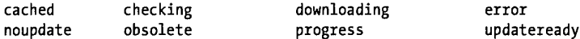

[TOC]

# 16事件处理

详情见菜鸟或MDN，这里只列出我没见过的。

## 跨浏览器的事件对象-EventUtil对象

为了解决跨浏览器的事件处理程序，需要编写一个方法，习惯上，这个方法属于一个名为EventUtil的对象，编写并使用该对象后，可保证处理事件的代码能在大多数浏览器下一致的运行。

```js
var EventUtil = {
	// 添加事件，保证对浏览器的兼容性。
	addHandler: function(element, type, handler) {
		if (element.addEventListener) {
			element.addEventListener(type, handler, false); //使用DOM2级方法添加事件
		} else if (element.attachEvent) {
			element.attachEvent("on" + type, handler);      //使用IE方法添加事件
		} else {
			element["on" + type] = handler;                 //使用DOM0级方法添加事件
		}
	},
	// 取消事件，保证对浏览器的兼容性。
	removeHandler: function (element, type, handler ) {
		if (element.removeEventListener) {
			element.removeEventListener(type, handler, false); //使用DOM2级方法取消事件
		} else if (element.detachEvent) {
			element.detachEvent("on" + type, handler);		   //使用IE方法取消事件
		} else {
			element["on" + type] = null;					   //使用DOM0级方法取消事件
		}
	},
	// 跨浏览器取得event事件对象
	getEvent: function(event) {
		return event ? event : window.event;     //event为兼容DOM浏览器中事件对象；window.event为IE浏览器中事件对象
	},
	// 返回事件的实际目标
	getTarget: function(event) {
		return event.target || event.srcElement; //target为兼容DOM浏览器中事件对象属性；srcElement为IE浏览器中事件对象属性
	},
	// 阻止事件的默认行为
	preventDefault: function(event) {
		if (event.preventDefault) {
			event.preventDefault();    //兼容DOM浏览器
		} else {
			event.returnValue = false; //IE浏览器
		}
	},
	// 阻止事件冒泡
	stopPropagation: function(event) {
		if (event.stopPropagation) {
			event.stopPropagation();   //兼容DOM浏览器
		} else {
			event.cancelBubble = true; //IE浏览器
		}
	}
}
```

## 离线上线事件

HTML5包含了对离线Web应用的支持，它们可以安装到本地应用缓存中所以即使浏览器离线时它们依旧能运行，比如当移动设备不在网络范围内时。相关的两个最重要事件是offline和online，无论何时浏览器失去或得到网络连接都会在Window对象上触发它们。标准还定义了大量其他事件来通知应用下载进度和应用缓存更新：



## 取消事件传播

调用事件对象的一个stopPropagation()方法组织事件的继续传播

```js
document.getElementById('box_1').onclick=function(e){
  e.stopPropagation();//取消事件传播
  e.preventDefault();//阻止默认事件
}
```

## textinput事件

此事件不管来源(例如:键盘、粘贴或拖放形式的数据传输、亚洲语言输入法、声音或手写识别系统)，无论何时用户输入文本时都会触发它。

```js
var textbox = document.getElementById("mytext");
EventUtil.addHandler(textbox, 'textInput', function (event) {
	event = EventUtil.getEvent(event);
	console.log(event.data);
});
```

### inputMethod
event 对象上还有一个属性叫 inputMethod，表示把文本输入到文本框中的方式。（只有 IE 支持）
可取值：

1. 表示浏览器不确定是怎样输入的。
2. 表示是使用键盘输入的。
3. 表示文本是粘贴进来的。
4. 表示文本是拖放进来的。
5. 表示文本是用 IME 输入的。
6. 表示文本是通过在表单中选择某一项输入的。
7. 表示文本是通过手写输入的（比如手写笔）。
8. 表示文本是通过语音输入的。
9. 表示文本是通过几种方法组合输入的。
10. 表示文本是通过脚本输入的。