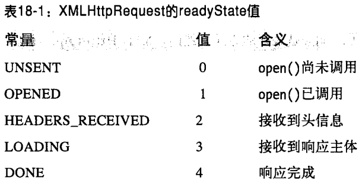

# 17脚本化HTTP

书上这章的内容基本都是草案，因此我这里粗略记录。

## XMLHttpRequest

读者自行了解，现在用的很少了，用fetch()更多（虽然我看fetch里面还是用了XMLHttpRequest）。



## 基于服务器端推送事件的Comet技术

草案中定义了一个EventSource对象，简化了Comet应用程序的编写可以传递一个URL给EventSource()构造函数，然后在返回的实例上监听消息事件。

```js
var ticker = new EventSource("stockprices.php”);
ticker.onmessage = function(e){
	var type = e.type;
	var data =e.data;
	//现在处理事件类型和事件的字符串数据
}
```

与message事件关联的事件对象有一个data属性，这个属性保存服务器作为该事件的负载发送的任何字符串。如同其他类型的事件一样，该对象还有一个type属性，默认值是message，事件源可以修改这个值。onmessage事件处理程序接收从一个给定的服务器事件源发出的所有事件，如果有必要，也可以根据type属性派发一个事件。