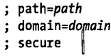

[TOC]

# 18客户端存储

客户端存储有以下几种形式：

## Web存储
Web存储最初作为HTML5的一部分被定义成API形式，但是后来被剥离出来作为独立的一份标准了。Web存储标准所描述的API包含localstorage对象和sessionstorage对象，这两个对象实际上是持久化关联数组是名值对的映射表，"名”和“值”都是字符串。Web存储易于使用，支持大容量(但非无限量)数据存储。

### localStorage

#### 使用

```js
var name = localStorage.username;//返回一个字符串,undefined也是字符串
if (name === "undefined") {//询问用户一个问题
    name = prompt("what is your name?");
    localStorage.username = name;// 存储用户的答案
}
//选代所有存储的name/value对
for (var name in localStorage) { //选代所有存储的名字
    var value = localStorage[name]; //查询每个名字对应的值
}
```

目前（2023/3）还只能存字符串类型，因此使用JSON格式处理会很方便。

setItem()：`localStorage.setItem("x",1);//会把1转成字符串存`

getItem()：`localStorage。getItem("X");`

removeItem()：`localStorage.removeItem("X");`

clear()：`localStorage.clear();//全部删除`

length属性

#### 存储事件

存储在localstorage的数据发生改变，浏览器会在其他对该数据可见的窗口对象上触发存储事 (但是，在对数据进行改变的窗口对象上是不会触发的)。如果浏览器有两个标签页都打开了来自同源的页面，其中一个页面在localstorage上存储了数据，那么另外一个标签页就会接收到一个存储事件。还有要注意的是，只有当存储数据真正发生改变的时候才会触发存储事件。 像给已经存在的存储项设置一个一模一样的值，抑或是删除一个本来就不存在的存储项都是不会触发存储事件的。

#### 存储有效期和作用域

**有效期**：永久性，除非Web应用刻意删除，或者用户通过设置更改。

**作用域**：localstorage的作用域是限定在文档源 (document origin)级别的。文档源是通过协议、主机名以及端口三者来确定的，因此，下面每个URL都拥有不同的文档源:

1. http://www.example.com// 协议:http;主机名:www.example.com
2. https://wwwexamplecom//不同协议
3. http://static.example.com//不同主机名
4. http://www.example.com:8000// 不同端口

同源的文档间共享同样的localstorage数据 (不论该源的脚本是否真正地访问localstorage)。它们可以互相读取对方的数据，甚至可以覆盖对方的数据。但是，非同源的文档间互相都不能读取或者覆盖对方的数据 (即使它们运行的脚本是来自同一台第三方服务器也不行)。
需要注意的是localstorage的作用域也受浏览器供应商限制。如果你使用Firefox访问站点，那么下次用另一个浏览器 (比如，Chrome) 再次访问的时候，那么本次是无法获取上次存储的数据的。

### sessionStorage

用法同localStorage。也有存储事件。

####  存储有效期和作用域

**有效期**：一旦顶层窗口或标签页被永久关闭了，那么所有通过sessionStorage存储的数据也都被删除了。 (要注意的是，现代浏览器已经具备了重新打开最近关闭的标签页随后恢复上一次浏览的会话功能，因此，这些标签页以及与之相关的sessionstorage的有效期可能会更加长些)

**作用域**：同文档源同标签页

## cookie
cookie是一种早期的客户端存储机制，起初是针对服务器端脚本设计使用的。尽管在客户端提供了非常繁琐的JavaScriptAPI来操作cookie，但它们难用至极，而且只适合存储少量文本数据。不仅如此，任何以cookie形式存储的数据，不论服务器端是否需要，每一次 HTTP请求都会把这些数据传输到服务器端。cookie目前仍然被客户端程序员大量使用的一个重要原因是:所有新旧浏览器都支持它。但是，随着Web Storage的普及，cookie终将会回归到最初的形态:作为一种被服务端脚本使用的客户端存储机制。

### 使用

#### 介绍

```js
//由于cookie的键/值中的值是不允许包含分号、逗号和空白符，因此，在存储前一般可以采用JavaScript核心的全局函数encodeURIComponent()对值进行编码。相应的，读取 cookie值的时候需要采用decodeURIComponent()函数解码。
document.cookie ="version=" + encodeURIComponent(document.lastModified);
```

#### max-age

```js
// 通过max-age改有效期，不同属性用分号间隔
// 以名/值的形式存储cookie
//同时采用encodeURIComponent()函数进行编码，来转义分号、逗号和空白符
// 如果daysToLive是一个数字，设置max-age属性为该数值表示cookie直到指定的天数
//到了才会过期。如果daysToLive是0就表示删除cookie
function setcookie(name, value, daysToLive) {
	var cookie = name + "=" + encodeURIComponent(value);
	if (typeof daysToLive === "number")
		cookie += ";max-age=" + (daysToLive * 60 * 60 * 24);
	document.cookie = cookie;
}
```

#### path、domain、secure

同样地，如果要设置cookie的path、domain和secure属性，只须在存储cookie值前，以如下字符串形式追加在cookie值的后面：

#### 读取cookie

使用JavaScript表达式来读取cookie属性的时候，其返回的值是一个字符串，该字符申都是由一系列名/值对组成，不同名/值对之间通过“分号和空格”分开，其内容包含了所有作用在当前文档的cookie。通过document.cookie属性可以获取cookie的值，但是为了更好地查看cookie的值，一般会采用split()方法将cookie值中的名/值对都分离出来。

把cookie的值从cookie属性分离出来之后，必须要采用相应的解码方式把值还原出来。比如，先采用decodeURIComponent()方法把cookie值解码出来，之后再利用JSON.parse()方法转化成ison对象，例：

```js
//将document.cookie的值以名/值对组成的一个对象返回
//假设存储cookie的值的时候是采用encodeURIComponent0)函数编码的
function getcookie() {
    var cookie = {}; //初始化最后要返回的对象
    var all = document.cookie;//在一个大写字符中获取所有的cookie值
    if (all === "")//如果该cookie属性值为空字符申
        return cookie;// 返回一个空对象
    var list = all.split(";"); // 分离出名/值对
    for (var i = 0; i < list.length; i++) {// 遍历每个cookie
        var cookie = list[i];
        var p = cookie.index0f("=");//查找第一个”=”符号//获取cookie名字
        var name = cookie.substring(0, p);//获取cookie对应的值
        var value = cookie.substring(p + 1);//将名/值对存储到对象中
        value = decodeURIComponent(value);//对其值进行解码
        cookie[name] = value;
    }
    return cookie;
}
```


### 检测cookie是否启用

通过检测navigator.cookieEnabled这个属性实现。若值为true，则当前cookie是启用的，反之是禁用的（但是，只具备 “当前浏览会话生命周期“的非持久化cookie仍然是启用的）。

### 有效期

cookie默认的有效期很短，只能持续在Web浏览器的会话期间，一旦用户关闭浏览器，cookie保存的数据就丢失了。要注意的是：这与sessionStorage的有效期还是有区别的：coookie的作用域并不是局限在浏览器的单个窗口中，它的有效期和整个浏览器进程而不是单个浏览器窗口的有效期一致。如果想要延长cookie的有效期，可以通过设置max-age属性，但是必须要明确告诉浏览器cookie的有效期是多长 (单位是秒)一旦设置了有效期，浏览器就会将cookie数据存储在一个文件中，并且直到过了指定的有效期才会删除该文件。

### 作用域

cookie的作用域是通过文档源和文档路径来确定的。该作用域通过cookie的path和domain属性也是可配置的。默认情况下，cookie和创建它的Web页面有关，并对该Web页面以及和该Web页面同目录或者子目录的其他Web页面可见。例：Web页面http://www.example.com/catalog/index.html页面创建了一个cookie，那么该 cookie对http://www.example.com/catalog/order.htm页面和http://www.example.com/catalog/widgets/index.html页面都是可见的，但它对http://www.example.com/about.html页面不可见。

默认的cookie的可见性行为满足了最常见的需求。不过有时候，你可能希望让整个网站都能够使用cookie的值，而不管是哪个页面创建它的。要满足这样的需求，可以设置cookie的路径(设置cookie的path属性)。这样一来，来自同一个Web服务器的Web页面，只要其URL是以指定的路径前缀开始的，都可以共享cookie。例如，如果http://www.example.com/catalog/widgets/index.htmi页面创建了一个cookie，并且将该路径设置成“/catalog”，那么该cookie对于http://lwww.example.com/catalog/order.html页面也是可见的。或者，如果把路径设置成“/”那么该cookie对任何http://wwwexample.com这台Web服务器上的页面都是可见的。

cookie的作用域默认由文档源限制。但是，有的大型网站想要子域之间能够互相共享cookie。这时就需要通过设置cookie的domain属性来达到目的。如果catalog.example.com域下的一个页面创建了一个cookie，并将其path属性设置成“/”，其domain属性设置成“.example.com”，那么该cookie就对所有catalog.example.com、orders.example.com以及任何其他example.com域下的任何其他服务器都可见。如果没有为一个cookie设置域属性，那么domain属性的默认值是当前Web服务器的主机名。要注意的是，cookie的域只能设置为当前服务器的域。

最后要介绍的cookie的属性是secure，它是一个布尔类型的属性，用来表明cookie的值以何种形式通过网络传递。cookie默认是以不安全的形式(通过普通的、不安全的HTTP连接)传递的。而一旦cookie被标识为“安全的”，那就只能当浏览器和服务器通过HTTPS或者其他的安全协议连接的时候才能传递它。

## IE User Data

微软在IE5及之后的IE浏览器中实现了它专属的客户端存储机制-“userData”userData可以实现一定量的字符串数据存储，对于IE8以前的IE浏览器中，可以将其用做是Web存储的替代方案。
## 离线Web应用

HTML5标准中定义了一组“离线Web应用”API用以缓存Web页面以及相关资源(脚本、CSS文件、图像等)。它实现的是将Web应用整体存储在客户端，而不仅仅是存储数据。它能够让Web应用“安装”在客户端，这样一来，哪怕网络不可用的时候Web应用依然是可用的。

### 应用程序缓存清单

想要将应用程序“安装”到应用程序缓存中，首先要创建一个清单:包含了所有应用程序依赖的所有URL列表。然后，通过在应用程序主HTML页面的\<html>标签中设置manifest属性，指向到该清单文件就可以了：

```html
<!DOCTYPE HTML>
<html manifest="myapp.appcache">
<head>...</head>
<body>...</body>
</htm1>
```

清单文件中的首行内容必须以“CACHE MANIFEST”字符开始。其余就是要缓存的文件URL列表，一行一个URL。相对路径的URL都相对于清单文件的URL。会忽略内容中的空行，会作为注释而忽略以“#”开始的行。注释前面可以有空格，但是在同一行注释后面是不允许有非空字符的。如下所示是一个简单的清单文件：

```
CACHE MANIFEST
#上一行标识此文件是一个清单文件。本行是注释

#下面的内容都是应用程序依赖的资源文件的URL
myapp.html
myapp.js
myapp.css
images/background.png
```

**复杂的清单**

另外两种区域是以“Network:”和“FALLBACK:”头信息开始的

“NETWORK:”区域标识了该URL中的资源从不缓存，总要通过网络获取。

“FALLBACK:”区域中的清单项每行都包含两个URL。第一个URL是一个前缀，第二个URL是指需要加载和存储在缓存中的资源。例：

```
CACHE MANIFEST

CACHE:
myapp.html
myapp.css
myapp.js

FALLBACK:
videos/ offline help.html

NETWORK:
cgi/
```

### 缓存的更新

在线状态下，浏览器会异步地检查清单文件是否有更新。如果有更新，新的清单文件以及清单中列举的所有文件都会下载下来重新保存到应用程序缓存中。但是，要注意的是，浏览器只是检查清单文件，而不会去检查缓存的文件是否有更新:只检查清单文件。比如，如果修改了一个缓存的JavaScript文件，并且要想让该文件生效，就必须去更新下清单文件。由于应用程序依赖的文件列表其实并没有变化，因此最简单的方式就是更新版本号：

```
CACHE MANIFEST
# MyApp version 1(更改这个数字以便让浏览器重新下载这个文件)
MyApp.html
MyApp.js
```

浏览器在更新缓存过程中会触发一系列事件，可以通过注册处理程序来跟踪这个过程同时提供反馈给用户。如下例所示：

```js
applicationCache.onupdateready = function () {
	var reload = confirm("A new version of this application is availableln" + "and will be used the next time you reload.in" + "Do you want to reload now?");
	if (reload) location.reload();
}
```

要注意的是，该事件处理程序是注册在ApplicationCache对象上的，该对象是Window的applicationCache属性的值。支持应用程序缓存的浏览器会定义该属性。此外，除了上面例子中的updateready事件之外，还有其他7种应用程序缓存事件可以监控。

1. applicationCache.onchecking
2. applicationCache.onnoupdate
3. applicationCache.ondownloading
4. applicationCache.onprogress
5. applicationCache.oncached
6. applicationCache.onerror
7. applicationCache.onobsolete

## Web数据库

为了能够让开发者像使用数据库那样来操作大量数据，很多主流的浏览器纷纷在其中开始集成客户端数据库的功能。Safari、Chrome和Opera都内置了SQL数据库的客户端API。遗憾的是，这类API的标准化工作以失败告终，并且Firefox和IE看样子也都不打算实现这种API。目前还有一种正在标准化的数据库API，称为“索引数据库API” (Indexed Database API)。调用该API返回的是一个不包含查询语言的简单数据库对象。这两种客户端数据库API都是异步的，都使用了事件处理机。这样的方式多多少少会显得有些复杂，不对它们做介绍。

## 文件系统API

现在主流浏览器都支持一个文件对象，用以将择的文件通过XMLHttpRequest上传到服务端。与之相关的规范 (草案阶段)定义了一组API，用于操作一个私有的本地文件系统。在该文件系统中可以进行对文件的读写操作。这些内容正在紧锣密鼓标准化当中。随着这些API被广泛地实现和支持，Web应用可以使用类似基于文件的存储机制，这对于大部分程序员来说再熟悉不过了。