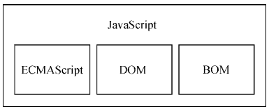
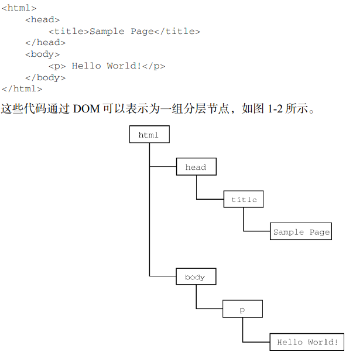

[TOC]

# 01ECMAScript_DOM_BOM

## 总关系图

## ECMAScript

### 介绍

ECMAScript，即 ECMA-262 定义的语言，并不局限于 Web 浏览器。事实上，这门语言没有输入和 输出之类的方法。ECMA-262 将这门语言作为一个基准来定义，以便在它之上再构建更稳健的脚本语言。 Web 浏览器只是 ECMAScript 实现可能存在的一种宿主环境（host environment）。宿主环境提供 ECMAScript 的基准实现和与环境自身交互必需的扩展。扩展（比如 DOM）使用 ECMAScript 核心类型 和语法，提供特定于环境的额外功能。其他宿主环境还有服务器端 JavaScript 平台 Node.js 和即将被淘汰 的 Adobe Flash。

### ECMAScript到底定义了什么

在基本的层面，它描述这门语言的如下部分：

  语法  类型  语句  关键字  保留字  操作符  全局对象

ECMAScript 只是对实现这个规范描述的所有方面的一门语言的称呼。JavaScript 实现了 ECMAScript，而 Adobe ActionScript 同样也实现了 ECMAScript。

## DOM

### 介绍

文档对象模型（DOM，Document Object Model）是一个应用编程接口（API），用于在 HTML中使用扩展的 XML。DOM将整个页面抽象为一组分层节点。

DOM 通过创建表示文档的树，让开发者可以随心所欲地控制网页的内容和结构。使用 DOM API， 可以轻松地删除、添加、替换、修改节点。

## BOM

### 介绍

浏览器对象模型（BOM）主要针对浏览器窗口和子窗口（frame），不过人们通常会把任何特定于浏览器的扩展都归在BOM的范畴内。使用BOM，开发者可以操控浏览器显示页面之外的部分。人们通常会把任何特定于浏览器的 扩展都归在 BOM 的范畴内。比如，下面就是这样一些扩展：

1. 弹出新浏览器窗口的能力；
2. 移动、缩放和关闭浏览器窗口的能力；
3. navigator 对象，提供关于浏览器的详尽信息；
4. location 对象，提供浏览器加载页面的详尽信息；
5. screen 对象，提供关于用户屏幕分辨率的详尽信息；
6. performance 对象，提供浏览器内存占用、导航行为和时间统计的详尽信息；
7. 对 cookie 的支持；
8. 其他自定义对象，如 XMLHttpRequest 和 IE 的 ActiveXObject。

## 总结

JavaScript 是一门用来与网页交互的脚本语言，包含以下三个组成部分。

1.  ECMAScript：由 ECMA-262 定义并提供核心功能。
2. 文档对象模型（DOM）：提供与网页内容交互的方法和接口。
3. 浏览器对象模型（BOM）：提供与浏览器交互的方法和接口。