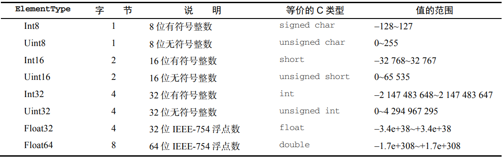

# 05集合引用类型

## Array

### 创建数组

Array 构造函数还有两个 ES6 新增的用于创建数组的静态方法：from()和 of()。from()用于将类数组结构转换为数组实例，而 of()用于将一组参数转换为数组实例。

#### Array.from()

Array.from()的第一个参数是一个类数组对象，即任何可迭代的结构，或者有一个 length 属性 和可索引元素的结构。这种方式可用于很多场合：

```
// 字符串会被拆分为单字符数组
console.log(Array.from("Matt")); // ["M", "a", "t", "t"]
// 可以使用 from()将集合和映射转换为一个新数组
const m = new Map().set(1, 2).set(3, 4);
const s = new Set().add(1).add(2).add(3).add(4);
console.log(Array.from(m)); // [[1, 2], [3, 4]]
console.log(Array.from(s)); // [1, 2, 3, 4]
// Array.from()对现有数组执行浅复制
const a1 = [1, 2, 3, 4]; 
const a2 = Array.from(a1); 
console.log(a1); // [1, 2, 3, 4] 
alert(a1 === a2); // false 
// 可以使用任何可迭代对象
const iter = {
	*[Symbol.iterator]() {
		yield 1;
		yield 2;
		yield 3;
		yield 4;
	}
};
console.log(Array.from(iter)); // [1, 2, 3, 4]
// arguments 对象可以被轻松地转换为数组
function getArgsArray() {
	return Array.from(arguments);
}
console.log(getArgsArray(1, 2, 3, 4)); // [1, 2, 3, 4]
// from()也能转换带有必要属性的自定义对象
const arrayLikeObject = {
	0: 1,
	1: 2,
	2: 3,
	3: 4,
	length: 4
};
console.log(Array.from(arrayLikeObject)); // [1, 2, 3, 4]
```

Array.from()还接收第二个可选的映射函数参数。这个函数可以直接增强新数组的值，而无须像 调用 Array.from().map()那样先创建一个中间数组。还可以接收第三个可选参数，用于指定映射函数中 this 的值。但这个重写的 this 值在箭头函数中不适用。

```js
const a1 = [1, 2, 3, 4]; 
const a2 = Array.from(a1, x => x**2); 
const a3 = Array.from(a1, function(x) {return x**this.exponent}, {exponent: 2}); 
console.log(a2); // [1, 4, 9, 16] 
console.log(a3); // [1, 4, 9, 16]
```

#### Array.of()

把一组参数转换为数组。这个方法用于替代在 ES6之前常用的 Array.prototype.  slice.call(arguments)，一种异常笨拙的将 arguments 对象转换为数组的写法：

```js
console.log(Array.of(1, 2, 3, 4)); // [1, 2, 3, 4]
console.log(Array.of(undefined)); // [undefined]
```

### 检测数组

一个经典的 ECMAScript 问题是判断一个对象是不是数组。在只有一个网页（因而只有一个全局作 用域）的情况下，使用 instanceof 操作符就足矣：

```js
if (value instanceof Array){ 
 // 操作数组
}
```

使用 instanceof 的问题是假定只有一个全局执行上下文。如果网页里有多个框架，则可能涉及两 个不同的全局执行上下文，因此就会有两个不同版本的 Array 构造函数。如果要把数组从一个框架传 给另一个框架，则这个数组的构造函数将有别于在第二个框架内本地创建的数组。

为解决这个问题，ECMAScript 提供了 Array.isArray()方法。这个方法的目的就是确定一个值是 否为数组，而不用管它是在哪个全局执行上下文中创建的。来看下面的例子：

```js
if (Array.isArray(value)){ 
 // 操作数组
}
```

### 迭代器方法

在 ES6 中，Array 的原型上暴露了 3 个用于检索数组内容的方法：keys()、values()和 entries()。keys()返回数组索引的迭代器，values()返回数组元素的迭代器，而 entries()返回索引/值对的迭代器：

```js
const a = ["foo", "bar", "baz", "qux"]; 
// 因为这些方法都返回迭代器，所以可以将它们的内容
// 通过 Array.from()直接转换为数组实例
const aKeys = Array.from(a.keys()); 
const aValues = Array.from(a.values()); 
const aEntries = Array.from(a.entries()); 
console.log(aKeys); // [0, 1, 2, 3] 
console.log(aValues); // ["foo", "bar", "baz", "qux"] 
console.log(aEntries); // [[0, "foo"], [1, "bar"], [2, "baz"], [3, "qux"]]
```

使用 ES6 的解构可以非常容易地在循环中拆分键/值对：

```js
const a = ["foo", "bar", "baz", "qux"]; 
for (const [idx, element] of a.entries()) { 
 alert(idx); 
 alert(element); 
}
```

### 栈方法

push()

pop()

### 队列方法

shift()

push()

### 排序方法

#### sort()

默认情况下，sort()会按照升序重新排列数组元素，即最小的值在前面，最大的值在后面。为此， sort()会在每一项上调用 String()转型函数，然后比较字符串来决定顺序。即使数组的元素都是数值， 也会先把数组转换为字符串再比较、排序。比如：

```js
let values = [0, 1, 5, 10, 15];
values.sort();
alert(values); // 0,1,10,15,5
```

sort()方法可以接收一个比较函数，用于判断哪个值应该排在前面。

比较函数接收两个参数，如果第一个参数应该排在第二个参数前面，就返回负值；如果两个参数相 等，就返回 0；如果第一个参数应该排在第二个参数后面，就返回正值。下面是使用简单比较函数的一 个例子：

```js
function compare(value1, value2) {
	return value2 - value1;//适用于返回数值的对象
}
```

这个比较函数可以适用于大多数数据类型，可以把它当作参数传给 sort()方法，如下所示：

```js
let values = [0, 1, 5, 10, 15]; 
values.sort(compare); 
alert(values); // 0,1,5,10,15
```

#### reverse()

reverse()方法就 是将数组元素反向排列。

### 迭代方法

#### every()

对数组每一项都运行传入的函数，如果对每一项函数都返回 true，则这个方法返回 true。

#### filter()

对数组每一项都运行传入的函数，函数返回 true 的项会组成数组之后返回。

```js
let numbers = [1, 2, 3, 4, 5, 4, 3, 2, 1]; 
let filterResult = numbers.filter((item, index, array) => item > 2); 
alert(filterResult); // 3,4,5,4,3
```

#### forEach()

对数组每一项都运行传入的函数，没有返回值。

```js
let numbers = [1, 2, 3, 4, 5, 4, 3, 2, 1]; 
numbers.forEach((item, index, array) => { 
 // 执行某些操作 
});
```

#### map()

对数组每一项都运行传入的函数，返回由每次函数调用的结果构成的数组。

```js
let numbers = [1, 2, 3, 4, 5, 4, 3, 2, 1]; 
let mapResult = numbers.map((item, index, array) => item * 2); 
alert(mapResult); // 2,4,6,8,10,8,6,4,2
```

#### some()

对数组每一项都运行传入的函数，如果有一项函数返回 true，则这个方法返回 true。

## 定型数组

定型数组（typed array）是 ECMAScript 新增的结构，目的是提升向原生库传输数据的效率。实际上， JavaScript 并没有“TypedArray”类型，它所指的其实是一种特殊的包含数值类型的数组。

### ArrayBuffer

ArrayBuffer()是一个普通的 JavaScript 构造函数，可用于在内存中分配特定数量的字节空间。

```js
const buf = new ArrayBuffer(16); // 在内存中分配 16 字节
alert(buf.byteLength);
```

ArrayBuffer 一经创建就不能再调整大小。不过，可以使用 slice()复制其全部或部分到一个新 实例中：

```js
const buf1 = new ArrayBuffer(16); 
const buf2 = buf1.slice(4, 12); 
alert(buf2.byteLength); // 8
```

ArrayBuffer 某种程度上类似于 C++的 malloc()，但也有几个明显的区别。

1. malloc()在分配失败时会返回一个 null 指针。ArrayBuffer 在分配失败时会抛出错误。

2. malloc()可以利用虚拟内存，因此最大可分配尺寸只受可寻址系统内存限制。ArrayBuffer

   分配的内存不能超过 Number.MAX_SAFE_INTEGER（253  1）字节。

3. malloc()调用成功不会初始化实际的地址。声明 ArrayBuffer 则会将所有二进制位初始化

   为 0。

4. 通过 malloc()分配的堆内存除非调用 free()或程序退出，否则系统不能再使用。而通过声明

   ArrayBuffer 分配的堆内存可以被当成垃圾回收，不用手动释放。

不能仅通过对 ArrayBuffer 的引用就读取或写入其内容。要读取或写入 ArrayBuffer，就必须 通过视图。视图有不同的类型，但引用的都是 ArrayBuffer 中存储的二进制数据。

### DataView

第一种允许你读写 ArrayBuffer 的视图是 DataView。这个视图专为文件 I/O 和网络 I/O 设计，其 API 支持对缓冲数据的高度控制，但相比于其他类型的视图性能也差一些。DataView 对缓冲内容没有任何预设，也不能迭代。

必须在对已有的 ArrayBuffer 读取或写入时才能创建 DataView 实例。这个实例可以使用全部或 部分 ArrayBuffer，且维护着对该缓冲实例的引用，以及视图在缓冲中开始的位置。

```js
const buf = new ArrayBuffer(16); 

// DataView 默认使用整个 ArrayBuffer 
const fullDataView = new DataView(buf); 
alert(fullDataView.byteOffset); // 0 
alert(fullDataView.byteLength); // 16 
alert(fullDataView.buffer === buf); // true 

// 构造函数接收一个可选的字节偏移量和字节长度
// byteOffset=0 表示视图从缓冲起点开始
// byteLength=8 限制视图为前 8 个字节
const firstHalfDataView = new DataView(buf, 0, 8); 
alert(firstHalfDataView.byteOffset); // 0 
alert(firstHalfDataView.byteLength); // 8 
alert(firstHalfDataView.buffer === buf); // true 

// 如果不指定，则 DataView 会使用剩余的缓冲
// byteOffset=8 表示视图从缓冲的第 9 个字节开始
// byteLength 未指定，默认为剩余缓冲
const secondHalfDataView = new DataView(buf, 8); 
alert(secondHalfDataView.byteOffset); // 8
alert(secondHalfDataView.byteLength); // 8 
alert(secondHalfDataView.buffer === buf); // true
```

要通过 DataView 读取缓冲，还需要几个组件。

1. 首先是要读或写的字节偏移量。可以看成 DataView 中的某种“地址”。
2. DataView 应该使用 ElementType 来实现 JavaScript 的 Number 类型到缓冲内二进制格式的转换。
3. 最后是内存中值的字节序。默认为大端字节序。

#### ElementType

DataView 对存储在缓冲内的数据类型没有预设。它暴露的 API 强制开发者在读、写时指定一个 ElementType，然后 DataView 就会忠实地为读、写而完成相应的转换。

ECMAScript 6 支持 8 种不同的 ElementType（见下表）



DataView 为上表中的每种类型都暴露了 get 和 set 方法，这些方法使用 byteOffset（字节偏移 量）定位要读取或写入值的位置。类型是可以互换使用的，如下例所示：

```js
// 在内存中分配两个字节并声明一个 DataView 
const buf = new ArrayBuffer(2); 
const view = new DataView(buf); 

// 说明整个缓冲确实所有二进制位都是 0 
// 检查第一个和第二个字符
alert(view.getInt8(0)); // 0 
alert(view.getInt8(1)); // 0 
// 检查整个缓冲
alert(view.getInt16(0)); // 0 

// 将整个缓冲都设置为 1 
// 255 的二进制表示是 11111111（2^8 - 1）
view.setUint8(0, 255); 

// DataView 会自动将数据转换为特定的 ElementType 
// 255 的十六进制表示是 0xFF 
view.setUint8(1, 0xFF); 

// 现在，缓冲里都是 1 了
// 如果把它当成二补数的有符号整数，则应该是-1（符号位不变，其它位全反过来后+1）
alert(view.getInt16(0)); // -1
```

#### 字节序

“字节序”指的是计算系统维护的一种字节顺序的约 定。DataView 只支持两种约定：大端字节序和小端字节序。大端字节序也称为“网络字节序”，意思 是最高有效位保存在第一个字节，而最低有效位保存在最后一个字节。小端字节序正好相反，即最低有 效位保存在第一个字节，最高有效位保存在最后一个字节。

JavaScript 运行时所在系统的原生字节序决定了如何读取或写入字节，但 DataView 并不遵守这 个约定。对一段内存而言，DataView 是一个中立接口，它会遵循你指定的字节序。DataView 的所 有 API 方法都以大端字节序作为默认值，但接收一个可选的布尔值参数，设置为 true 即可启用小端字节序。（学过汇编或计组的可能会很好理解）

```js
// 在内存中分配两个字节并声明一个 DataView
const buf = new ArrayBuffer(2);
const view = new DataView(buf);

// 填充缓冲，让第一位和最后一位都是 1
view.setUint8(0, 0x80); // 设置最左边的位等于 1
view.setUint8(1, 0x01); // 设置最右边的位等于 1

// 按大端字节序读取 Uint16
// 0x80 是高字节，0x01 是低字节
// 0x8001 = 2^15 + 2^0 = 32768 + 1 = 32769 
alert(view.getUint16(0)); // 32769 

// 按小端字节序读取 Uint16 
// 0x01 是高字节，0x80 是低字节
// 0x0180 = 2^8 + 2^7 = 256 + 128 = 384
alert(view.getUint16(0, true)); // 384

// 按大端字节序写入 Uint16
view.setUint16(0, 0x0004);
// 缓冲内容（为方便阅读，人为加了空格
// 0x0 0x0 0x0 0x4
// 0000 0000 0000 0100
alert(view.getUint8(0)); // 0
alert(view.getUint8(1)); // 4

// 按小端字节序写入 Uint16
view.setUint16(0, 0x0002, true);
// 缓冲内容（为方便阅读，人为加了空格）
// 0x0 0x2 0x0 0x0 
// 0000 0010 0000 0000 
alert(view.getUint8(0)); // 2 
alert(view.getUint8(1)); // 0
```

#### 边界情形

DataView 完成读、写操作的前提是必须有充足的缓冲区，否则就会抛出 RangeError：

```js
const buf = new ArrayBuffer(6);
const view = new DataView(buf);

// 尝试读取部分超出缓冲范围的值
view.getInt32(4);// RangeError

// 尝试读取超出缓冲范围的值
view.getInt32(8); // RangeError 
view.getInt32(-1); // RangeError 

// 尝试写入超出缓冲范围的值
view.setInt32(4, 123); // RangeError
```

DataView 在写入缓冲里会尽最大努力把一个值转换为适当的类型，后备为 0。如果无法转换，则 抛出错误：

```js
const buf = new ArrayBuffer(1);
const view = new DataView(buf);

view.setInt8(0, 1.5);
alert(view.getInt8(0)); // 1

view.setInt8(0, [4]); 
alert(view.getInt8(0)); // 4

view.setInt8(0, 'f'); 
alert(view.getInt8(0)); // 0

view.setInt8(0, Symbol()); // TypeError
```

#### 定型数组

定型数组是另一种形式的 ArrayBuffer 视图，它特定于一种 ElementType 且遵循系统原生的字节序。相应地，定型数组提供了适用面更广的 API 和更高的性能。设计定型数组的目的就是提高与 WebGL 等原生库交换二进制数据的效率。由于定型数组的二进制表示对操作系统而言是一种容易使用的格式，JavaScript 引擎可以重度优化算术运算、 按位运算和其他对定型数组的常见操作，因此使用它们速度极快。

创建定型数组的方式包括读取已有的缓冲、使用自有缓冲、填充可迭代结构，以及填充基于任意类 型的定型数组。另外，通过.from()和.of()也可以创建定型数组：

```js
// 创建一个 12 字节的缓冲
const buf = new ArrayBuffer(12); 
// 创建一个引用该缓冲的 Int32Array 
const ints = new Int32Array(buf); 
// 这个定型数组知道自己的每个元素需要 4 字节，因此长度为 3 
alert(ints.length); // 3

// 创建一个长度为 6 的 Int32Array 
const ints2 = new Int32Array(6); 
// 每个数值使用 4 字节，因此 ArrayBuffer 是 24 字节
alert(ints2.length); // 6 
// 类似 DataView，定型数组也有一个指向关联缓冲的引用
alert(ints2.buffer.byteLength); // 24 

// 创建一个包含[2, 4, 6, 8]的 Int32Array 
const ints3 = new Int32Array([2, 4, 6, 8]); 
alert(ints3.length); // 4 
alert(ints3.buffer.byteLength); // 16 
alert(ints3[2]); // 6 

// 通过复制 ints3 的值创建一个 Int16Array 
const ints4 = new Int16Array(ints3);
// 这个新类型数组会分配自己的缓冲
// 对应索引的每个值会相应地转换为新格式
alert(ints4.length); // 4 
alert(ints4.buffer.byteLength); // 8 
alert(ints4[2]); // 6

// 基于普通数组来创建一个 Int16Array 
const ints5 = Int16Array.from([3, 5, 7, 9]);
alert(ints5.length); // 4
alert(ints5.buffer.byteLength); // 8
alert(ints5[2]); // 7

// 基于传入的参数创建一个 Float32Array
const floats = Float32Array.of(3.14, 2.718, 1.618);
alert(floats.length); // 3
alert(floats.buffer.byteLength); // 12
alert(floats[2]); // 1.6180000305175781
```

定型数组的构造函数和实例都有一个 BYTES_PER_ELEMENT 属性，返回该类型数组中每个元素的大小：

```js
alert(Int16Array.BYTES_PER_ELEMENT); // 2 
alert(Int32Array.BYTES_PER_ELEMENT); // 4 

const ints = new Int32Array(1), floats = new Float64Array(1); 
 
alert(ints.BYTES_PER_ELEMENT); // 4 
alert(floats.BYTES_PER_ELEMENT); // 8
```

## Map

Map 是一种新的集合类型，为这门语言带来了真正的键/值存储机 制。Map 的大多数特性都可以通过 Object 类型实现，但二者之间还是存在一些细微的差异。

### 基本API

#### 初始化

可以给 Map 构造函数传入一个可迭代对象，需要包含键/值对数 组。可迭代对象中的每个键/值对都会按照迭代顺序插入到新映射实例中：

```js
// 使用嵌套数组初始化映射
const m1 = new Map([ 
 ["key1", "val1"], 
 ["key2", "val2"], 
 ["key3", "val3"] 
]); 
alert(m1.size); // 3 

// 使用自定义迭代器初始化映射
const m2 = new Map({ 
 [Symbol.iterator]: function*() { 
 yield ["key1", "val1"]; 
 yield ["key2", "val2"]; 
 yield ["key3", "val3"]; 
 } 
}); 
alert(m2.size); // 3 

// 映射期待的键/值对，无论是否提供
const m3 = new Map([[]]); 
alert(m3.has(undefined)); // true 
alert(m3.get(undefined)); // undefined
```

#### set()、get()、has()、delete()、clear()、size

初始化之后，可以使用 set()方法再添加键/值对。另外，可以使用 get()和 has()进行查询，可 以通过 size 属性获取映射中的键/值对的数量，还可以使用 delete()和 clear()删除值。

```js
const m = new Map(); 

alert(m.has("firstName")); // false 
alert(m.get("firstName")); // undefined 
alert(m.size); // 0 

m.set("firstName", "Matt") 
 .set("lastName", "Frisbie"); 
alert(m.has("firstName")); // true 
alert(m.get("firstName")); // Matt 
alert(m.size); // 2 

m.delete("firstName"); // 只删除这一个键/值对
alert(m.has("firstName")); // false 
alert(m.has("lastName")); // true 
alert(m.size); // 1 

m.clear(); // 清除这个映射实例中的所有键/值对
alert(m.has("firstName")); // false 
alert(m.has("lastName")); // false 
alert(m.size); // 0
```

### 顺序与迭代

Map 实例会维护键值对的插入顺序，因此可以根据插入顺序执 行迭代操作。 映射实例可以提供一个迭代器（Iterator），能以插入顺序生成[key, value]形式的数组。可以通过 entries()方法（或者 Symbol.iterator 属性，它引用 entries()）取得这个迭代器：

```js
const m = new Map([ 
 ["key1", "val1"], 
 ["key2", "val2"], 
 ["key3", "val3"] 
]); 

alert(m.entries === m[Symbol.iterator]); // true 

for (let pair of m.entries()) { 
 alert(pair); 
} 
// [key1,val1] 
// [key2,val2] 
// [key3,val3] 

for (let pair of m[Symbol.iterator]()) { 
 alert(pair); 
} 
// [key1,val1] 
// [key2,val2] 
// [key3,val3] 
```

因为 entries()是默认迭代器，所以可以直接对映射实例使用扩展操作，把映射转换为数组：

```js
const m = new Map([ 
 ["key1", "val1"], 
 ["key2", "val2"], 
 ["key3", "val3"] 
]); 

console.log([...m]); // [[key1,val1],[key2,val2],[key3,val3]]
```

如果不使用迭代器，而是使用回调方式，则可以调用映射的 forEach(callback, opt_thisArg) 方法并传入回调，依次迭代每个键/值对。传入的回调接收可选的第二个参数，这个参数用于重写回调 内部 this 的值：

```js
const m = new Map([ 
 ["key1", "val1"], 
 ["key2", "val2"], 
 ["key3", "val3"] 
]); 

m.forEach((val, key) => alert(`${key} -> ${val}`)); 
// key1 -> val1 
// key2 -> val2 
// key3 -> val3 
```

keys()和 values()分别返回以插入顺序生成键和值的迭代器：

```js
const m = new Map([ 
 ["key1", "val1"], 
 ["key2", "val2"], 
 ["key3", "val3"] 
]); 

for (let key of m.keys()) { 
 alert(key); 
} 
// key1 
// key2 
// key3 

for (let key of m.values()) { 
 alert(key); 
} 
// value1 
// value2 
// value3
```

### 选择Object还是Map

对于在乎内存和性能的开发者来说，对象和映射之间存在显著的差别。

#### 内存占用

Object 和 Map 的工程级实现在不同浏览器间存在明显差异，但存储单个键/值对所占用的内存数量都会随键的数量线性增加。批量添加或删除键/值对则取决于各浏览器对该类型内存分配的工程实现。 不同浏览器的情况不同，但给定固定大小的内存，Map 大约可以比 Object 多存储 50%的键/值对。

#### 插入性能

向 Object 和 Map 中插入新键/值对的消耗大致相当，不过插入 Map 在所有浏览器中一般会稍微快 一点儿。对这两个类型来说，插入速度并不会随着键/值对数量而线性增加。如果代码涉及大量插入操 作，那么显然 Map 的性能更佳。

#### 查找速度

与插入不同，从大型 Object 和 Map 中查找键/值对的性能差异极小，但如果只包含少量键/值对， 则 Object 有时候速度更快。在把 Object 当成数组使用的情况下（比如使用连续整数作为属性），浏 览器引擎可以进行优化，在内存中使用更高效的布局。这对 Map 来说是不可能的。对这两个类型而言， 查找速度不会随着键/值对数量增加而线性增加。如果代码涉及大量查找操作，那么某些情况下可能选择 Object 更好一些。

#### 删除性能

使用 delete 删除 Object 属性的性能一直以来饱受诟病，目前在很多浏览器中仍然如此。为此， 出现了一些伪删除对象属性的操作，包括把属性值设置为 undefined 或 null。但很多时候，这都是一 种讨厌的或不适宜的折中。而对大多数浏览器引擎来说，Map 的 delete()操作都比插入和查找更快。 如果代码涉及大量删除操作，那么毫无疑问应该选择 Map。

## WeakMap

“弱映射”（WeakMap）是一种新的集合类型，为这门语言带来了增强的键/ 值对存储机制。WeakMap 是 Map 的“兄弟”类型，其 API 也是 Map 的子集。WeakMap 中的“weak”（弱）， 描述的是 JavaScript 垃圾回收程序对待“弱映射”中键的方式。

**弱映射中的键只能是 Object 或者继承自 Object 的类型，尝试使用非对象设置键会抛出 TypeError**。值的类型没有限制。因此原始值可以先包装成对象再用作键。

### 弱键

WeakMap 中“weak”表示弱映射的键是“弱弱地拿着”的。意思就是，这些键不属于正式的引用， 不会阻止垃圾回收。但要注意的是，弱映射中值的引用可不是“弱弱地拿着”的。只要键存在，键/值 对就会存在于映射中，并被当作对值的引用，因此就不会被当作垃圾回收。

来看下面的例子：

```js
const wm = new WeakMap(); 
wm.set({}, "val");
```

set()方法初始化了一个新对象并将它用作一个字符串的键。因为没有指向这个对象的其他引用， 所以当这行代码执行完成后，这个对象键就会被当作垃圾回收。然后，这个键/值对就从弱映射中消失 了，使其成为一个空映射。在这个例子中，因为值也没有被引用，所以这对键/值被破坏以后，值本身 也会成为垃圾回收的目标。

再看一个稍微不同的例子：

```js
const wm = new WeakMap(); 

const container = { 
 key: {} 
}; 

wm.set(container.key, "val"); 
function removeReference() { 
 container.key = null; 
}
```

这一次，container 对象维护着一个对弱映射键的引用，因此这个对象键不会成为垃圾回收的目 标。不过，如果调用了 removeReference()，就会摧毁键对象的最后一个引用，垃圾回收程序就可以 把这个键/值对清理掉。

### 不可迭代键

因为 WeakMap 中的键/值对任何时候都可能被销毁，所以没必要提供迭代其键/值对的能力。当然， 也用不着像 clear()这样一次性销毁所有键/值的方法。WeakMap 确实没有这个方法。因为不可能迭代， 所以也不可能在不知道对象引用的情况下从弱映射中取得值。即便代码可以访问 WeakMap 实例，也没 办法看到其中的内容。 WeakMap 实例之所以限制只能用对象作为键，是为了保证只有通过键对象的引用才能取得值。如果 允许原始值，那就没办法区分初始化时使用的字符串字面量和初始化之后使用的一个相等的字符串了。

### 使用弱映射

WeakMap 实例与现有 JavaScript 对象有着很大不同，可能一时不容易说清楚应该怎么使用它。这个 问题没有唯一的答案，但已经出现了很多相关策略。

#### 私有变量

弱映射造就了在 JavaScript 中实现真正私有变量的一种新方式。前提很明确：私有变量会存储在弱 映射中，以对象实例为键，以私有成员的字典为值。例：

```js
const wm = new WeakMap(); 

class User { 
	constructor(id) { 
		this.idProperty = Symbol('id'); 
		this.setId(id); 
	} 
	setPrivate(property, value) { 
		const privateMembers = wm.get(this) || {}; 
		privateMembers[property] = value; 
		wm.set(this, privateMembers); 
	} 
	getPrivate(property) { 
		return wm.get(this)[property]; 
	} 
	setId(id) { 
		this.setPrivate(this.idProperty, id); 
	}
	getId() { 
		return this.getPrivate(this.idProperty); 
	} 
} 
const user = new User(123); 
alert(user.getId()); // 123 
user.setId(456); 
alert(user.getId()); // 456 
// 并不是真正私有的
alert(wm.get(user)[user.idProperty]); // 456
```

对于上面的实现，外部代码只需要拿到对象实例的引用和弱映射，就可以 取得“私有”变量了。为了避免这种访问，可以用一个闭包把 WeakMap 包装起来，这样就可以把弱映 射与外界完全隔离开了：

```js
const User = (() => { 
	const wm = new WeakMap(); 

	class User { 
		constructor(id) { 
			this.idProperty = Symbol('id');
			this.setId(id); 
		} 
		setPrivate(property, value) { 
			const privateMembers = wm.get(this) || {}; 
			privateMembers[property] = value; 
			wm.set(this, privateMembers); 
		} 
		getPrivate(property) { 
			return wm.get(this)[property]; 
		} 
		setId(id) { 
			this.setPrivate(this.idProperty, id); 
		} 
		getId(id) { 
			return this.getPrivate(this.idProperty); 
		} 
	} 
	return User; 
})(); 
const user = new User(123); 
alert(user.getId()); // 123 
user.setId(456); 
alert(user.getId()); // 456
```

这样，拿不到弱映射中的健，也就无法取得弱映射中对应的值。虽然这防止了前面提到的访问，但 整个代码也完全陷入了 ES6 之前的闭包私有变量模式。

#### DOM 节点元数据

因为 WeakMap 实例不会妨碍垃圾回收，所以非常适合保存关联元数据。来看下面这个例子，其中 使用了常规的 Map：

```js
const m = new Map(); 
const loginButton = document.querySelector('#login'); 
// 给这个节点关联一些元数据
m.set(loginButton, {disabled: true});
```

假设在上面的代码执行后，页面被 JavaScript 改变了，原来的登录按钮从 DOM 树中被删掉了。但 由于映射中还保存着按钮的引用，所以对应的 DOM 节点仍然会逗留在内存中，除非明确将其从映射中 删除或者等到映射本身被销毁。

如果这里使用的是弱映射，如以下代码所示，那么当节点从 DOM 树中被删除后，垃圾回收程序就 可以立即释放其内存（假设没有其他地方引用这个对象）：

```js
const wm = new WeakMap(); 
const loginButton = document.querySelector('#login'); 
// 给这个节点关联一些元数据
wm.set(loginButton, {disabled: true});
```


